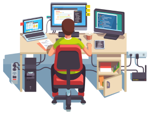

# Hola, Bienvenidos !! 👋

> No es quien termina primero sino como llegas a serlo!! 💪🙌

## 🚀 About Me
Soy Heyner Salvador de Perú. Mi meta es convertirme en Fullstack Developer y formar parte de este grandioso mundo, amante de la tecnologia, la programación y la cultura pop.

Por ultimo ....

> "Nunca olvides lo que eres, el resto del mundo no lo hará, úsalo como una armadura y nunca será usado para herirte"

## 5 Comandos de la terminal
| Comando | Descripción                                          |
|---------|------------------------------------------------------|
| cd      | Nos permite navegar entre carpetas                   |
| mkdir   | Crea una nueva carpeta dando un nombre a esa carpeta |
| ls      | Lista el contenido de la carpeta actual              |
| rm      | Elimina una carpeta                                  |
| -       | Representa regresar al directorio anterior           |

## 2 Comandos Alias Utiles
| Comando           | Descripción        |
|-------------------|------------------- |
| alias cl="clear"  | Limpia la terminal |
| alias tch="touch" | Crea un archivo    |

> npx @11ty/eleventy --serve
> http://localhost:8080/hosalvadorg/index.html